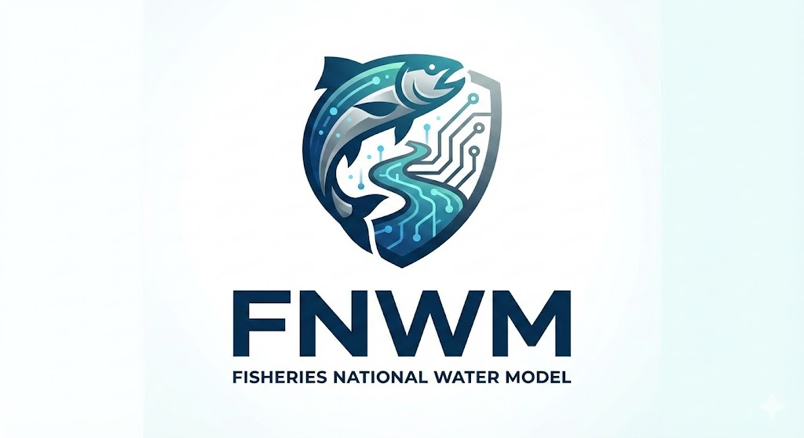

<div align="center">
  
</div>

# Fisheries Hydrology Intelligence Engine

**Status: 7 of 8 EPICs Complete | Production Ready**

This repository contains the core engineering code that transforms NOAA's **National Water Model (NWM)** into **explainable, fisheries-focused intelligence** for onWater products.

This is **not** a generic hydrology ingestion repo. Its purpose is to ingest a *minimal, opinionated subset* of NWM products and convert them into **species-, hatch-, and reach-specific metrics** that can be confidently surfaced to users.

**Live Features:** NWM ingestion, derived hydrologic metrics, thermal suitability, species/hatch scoring, confidence quantification, flow percentiles, wind forecasts, and production API.

---

## 🚀 What This Product Does

At a high level, this system:

1. **Ingests** selected NWM channel routing products from NOAA NOMADS
2. **Normalizes** all data into clean time abstractions ("Now", "Today", "Outlook")
3. **Computes** derived hydrologic and ecological metrics (rising limbs, baseflow, velocity, thermal suitability, flow percentiles)
4. **Integrates** weather data (Open-Meteo temperature, HRRR wind forecasts) for comprehensive condition assessment
5. **Scores** species-specific habitat suitability and hatch likelihood using transparent, auditable algorithms
6. **Quantifies** confidence and uncertainty in all predictions
7. **Exposes** clean REST APIs that never leak raw NWM complexity

The result is **trusted decision support**, not raw model output.

**Operational Scale:** 1,588 stream reaches with full hydrologic, spatial, and thermal data integration.

---

## 🎯 Design Principles (Read First)

These rules govern every line of code in this repo:

- **NWM is infrastructure, not a product**  
  Raw files, folders, and f### semantics are never exposed downstream.

- **Selectivity beats completeness**  
  ~80–90% of fisheries value comes from ~4 NWM products. We ingest only what we use.

- **Truth, prediction, and uncertainty are distinct**  
  “Now”, “Today”, and “Outlook” are separate concepts in data, APIs, and UX.

- **Ecology ≠ hydrology**  
  Gauge-corrected flows are best for display; non-assimilated flows are often better for ecological inference.

If a feature depends directly on a raw NWM variable, the work is not finished.

---

## 📦 Canonical NWM Products Used

This repo ingests **only** the following channel routing products:

| Purpose | NWM Product | Notes |
|------|-----------|------|
| Current conditions ("Now") | `analysis_assim/channel_rt` | Only valid source of truth for current flow |
| Near-term forecast (0–18h) | `short_range/channel_rt` | High temporal resolution |
| Multi-day outlook (3–10d) | `medium_range_blend/channel_rt` | Ensemble mean only |
| Ecological baseflow analysis | `analysis_assim_no_da/channel_rt` | No gauge nudging |

**Rules**
- Short-range `f001` is **never** used as “current”
- Individual ensemble members are never user-facing
- No-DA products are internal-only

---

## 🕒 Internal Time Abstractions

All NWM time semantics are collapsed into four internal concepts:

| Internal Term | Backing Data |
|-------------|-------------|
| `now` | `analysis_assim` |
| `today` | `short_range` (f001–f018) |
| `outlook` | `medium_range_blend` |
| `uncertainty` | `medium_range` ensemble members |

No downstream service should reason about filenames or `f###` values directly.

---

## 🌊 Core Derived Metrics

Raw NWM variables are never exposed. All intelligence is derived.

**Implemented Metrics:**

- **Rising Limb Detection** ✅ – Sustained positive flow derivatives with intensity classification
- **Flow Percentile Calculator** ✅ – Compares current flow to NHDPlus historical monthly means
  - 7 ecological categories (extreme_low through extreme_high)
  - Integrated with 1,588 operational reaches
  - Real-time percentile scoring in all API endpoints
- **Baseflow Dominance Index (BDI)** ✅ – Quantifies groundwater vs stormflow signal (0-1 scale)
- **Velocity Suitability** ✅ – Species-specific energetic windows with gradient scoring
- **Thermal Suitability Index (TSI)** ✅ – Water temperature prediction with species-specific thermal scoring
  - **Enhanced Mohseni S-curve model** for air-to-water temperature conversion
  - **Groundwater thermal buffering** based on BDI (cold-water springs moderate temperature)
  - **Elevation adjustments** for temperature lapse rate
  - Open-Meteo weather API integration (hourly forecasts, current + 16-day outlook)
  - Gradient scoring across optimal, stress, and critical thermal zones
  - Fully integrated into species habitat scoring

**Data Integrations:**

- **HRRR Wind Forecasts** ✅ – 3 km resolution wind data from NOAA
  - Hourly updates with 7-day retention
  - S3-hosted GeoJSON for map visualization
  - U/V wind components at 10m height

All metrics are:
- ✅ Deterministic
- ✅ Unit-testable
- ✅ Config-driven
- ✅ Explainable with reasoning

---

## 🐟 Species & Hatch Intelligence

This system supports **species-specific** and **hatch-specific** interpretation layers, including:

- Coldwater trout
- Warmwater bass
- Anadromous salmonids
- Key hatches (Green Drake, PMD, Caddis)

Scores are computed using transparent equations (0–1 normalized) with configurable weights owned by science/product—not hardcoded logic.

---

## 🔍 Confidence & Uncertainty

We explicitly communicate trust.

Confidence is derived from:
- Forecast lead time
- Ensemble spread
- Gauge influence (`nudge_m3s`)

Outputs are classified as **High / Medium / Low** and included alongside all recommendations.

---

## 🧪 Validation Framework (Planned - EPIC 8)

The final component of the system will evaluate predictions against observations:

- User trip reports (planned)
- Hatch observations (planned)
- USGS gauges (sanity checks)

Key metrics to track:
- Precision
- Recall
- Lead time
- Threshold calibration

**Status:** Database schema created, ingestion and scoring modules pending implementation.

---

## 🏗️ Repository Structure

```text
src/
├── ingest/            # NWM ingestion & scheduling ✅
├── normalize/         # Time & schema normalization ✅
├── metrics/           # Derived hydrology metrics ✅
│   ├── rising_limb.py
│   ├── baseflow.py
│   ├── velocity.py
│   ├── thermal_suitability.py
│   └── flow_percentile.py
├── temperature/       # Temperature ingestion & prediction ✅
│   ├── open_meteo.py        # Weather API client
│   └── prediction.py        # Enhanced water temp models
├── species/           # Species scoring logic ✅
├── hatches/           # Hatch-specific rules ✅
├── confidence/        # Uncertainty & confidence scoring ✅
├── api/               # FastAPI endpoints ✅
├── database/          # Database utilities ✅
└── validation/        # Model performance & feedback loop (planned)

scripts/
├── setup/             # Database initialization
│   ├── init_nhd_schema.py
│   ├── init_temperature_tables.py
│   └── create_*.sql
├── production/        # Production workflows
│   ├── run_full_ingestion.py
│   ├── ingest_temperature.py
│   ├── export_map_geojson.py
│   └── reset_and_repopulate_db.py
├── satellite_data/    # External data pipelines ✅
│   └── wind/          # HRRR wind forecasts
│       ├── run_pipeline.py
│       ├── dataFetcher.py
│       ├── processGrib.py
│       └── uploadToS3.py
└── tests/             # Test & verification scripts
    ├── test_flow_percentile.py
    ├── test_enhanced_temperature_model.py
    └── ...

config/
├── species/           # Species thresholds (YAML)
├── hatches/           # Hatch signatures (YAML)
└── thresholds/        # Metric thresholds (YAML)
```

**Database Integration:**
- PostgreSQL 17.6 with PostGIS extension (AWS RDS)
- TimescaleDB for time-series hypertables
- 11 tables including spatial, hydrologic, thermal, and network data
- 1,822 NHDPlus reaches with spatial geometry
- 1,588 reaches operational with full NWM-NHD-thermal integration

**Cloud Infrastructure:**
- Terraform-managed AWS resources
- S3 buckets for wind data (7-day retention)
- Auto-scaling storage (20GB → 1TB)

---

## 🔌 API Philosophy

APIs exposed by this repo:

- Are **reach-centric** (`feature_id` based on NHDPlus identifiers)
- Support `now`, `today`, and `outlook` time abstractions
- Never expose raw NWM variables or internal complexity
- Always include explanation and confidence metadata
- Return GeoJSON-compatible structures for map integration

**Available Endpoints:**
- `GET /health` – System health and database status
- `GET /metadata` – Available species, hatches, and configuration
- `GET /hydrology/reach/{feature_id}` – Real-time hydrologic conditions with flow percentiles
- `GET /fisheries/reach/{feature_id}/score` – Species-specific habitat scoring (4 components)
- `GET /fisheries/reach/{feature_id}/hatches` – Hatch likelihood predictions

**Documentation:** Interactive Swagger UI at `/docs` and ReDoc at `/redoc`

If an API response cannot explain *why* a recommendation was made, it should not ship.

---

## 📜 Product Integrity Rule

> If a feature cannot explain its recommendation in terms of flow, velocity, temperature, and stability, it does not ship.

This repository is the contract between **science, engineering, and product**.

---

## 🚀 Getting Started

### Quick Setup (Conda - Recommended)

```bash
# Create conda environment
conda env create -f environment.yml

# Activate environment
conda activate fnwm

# Configure environment
cp .env.example .env
# Edit .env with your database credentials

# Run the API server
python -m uvicorn src.api.main:app --reload --host 0.0.0.0 --port 8000

# Visit http://localhost:8000/docs for interactive API documentation
```

### Production Workflows

```bash
# Full NWM data ingestion
python scripts/production/run_full_ingestion.py

# Temperature data ingestion
python scripts/production/ingest_temperature.py

# Wind data pipeline
cd scripts/satellite_data/wind
python run_pipeline.py

# Export current conditions to GeoJSON
python scripts/production/export_map_geojson.py
```

See [docs/development/project-status.md](docs/development/project-status.md) for detailed status and implementation guide.

---

## 📚 References

**External Data Sources:**
- NOAA National Water Model: https://water.noaa.gov/about/nwm
- NWM Data Access (NOMADS): https://nomads.ncep.noaa.gov/pub/data/nccf/com/nwm/
- Open-Meteo Weather API: https://open-meteo.com/
- HRRR Wind Data: NOAA NOMADS GRIB2 archive

**Project Documentation:**
- [Project Status](docs/development/project-status.md) – Current implementation status (7/8 EPICs complete)
- [NHD Integration Guide](docs/guides/nhd-integration.md) – Spatial data integration
- [EPIC Completion Summaries](docs/development/) – Detailed completion reports

**API Documentation:**
- Interactive Swagger UI: `http://localhost:8000/docs` (when running locally)
- ReDoc: `http://localhost:8000/redoc`

---

## 🧭 Final Note

Shipping raw hydrology is easy.

Shipping **trusted fisheries intelligence**—that users can understand, trust, and act on—is the work.

**We did the work.** 🚀

**Status:** 7 of 8 EPICs complete. Production-ready API. 1,588 operational stream reaches with full hydrologic, thermal, and spatial integration.

